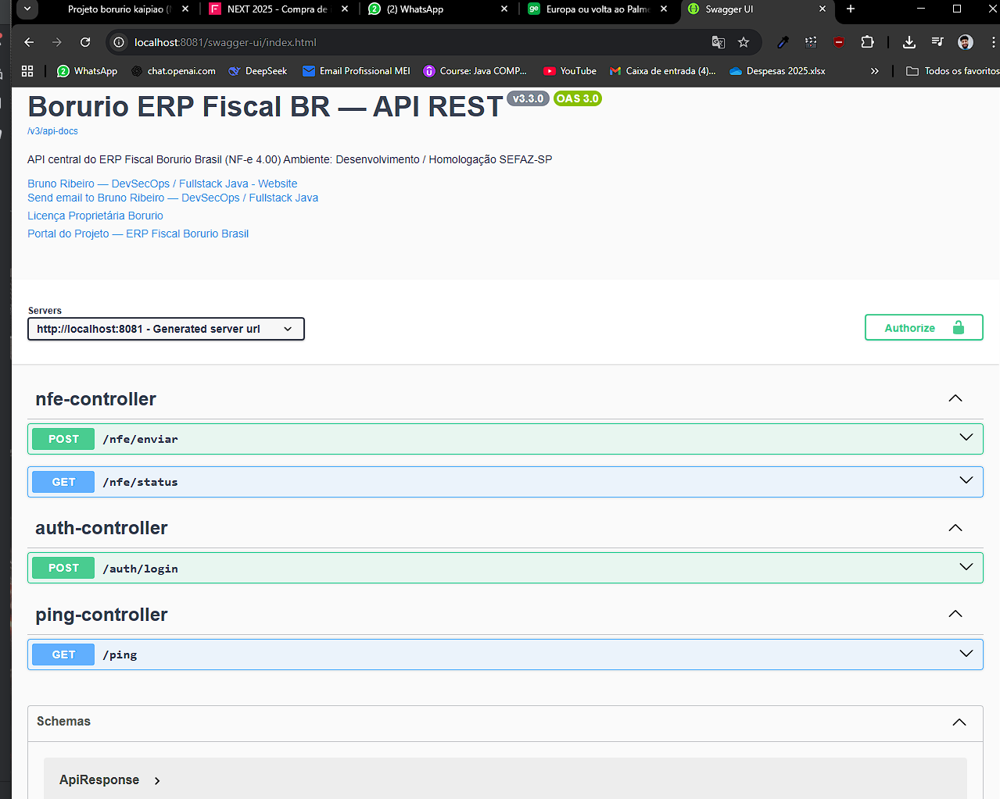

Relatório Técnico – 21/10/2025
Sprint Fiscal 3.2 — Estabilização do Ambiente DEV e Preparação da Homologação SEFAZ-SP
🧭 Resumo Técnico

O dia foi dedicado à restauração completa e estabilização do ambiente de desenvolvimento do projeto Borurio ERP Fiscal BR, consolidando o build multi-módulo Maven e garantindo a comunicação plena com os serviços auxiliares via Docker Compose (MySQL, Redis, MinIO, Mailpit).
O sistema foi executado com sucesso em perfil dev, validando a integração real SEFAZ-SP (tpAmb=2) e a infraestrutura DevSecOps com Dockerfile raiz unificado.

A partir deste ponto, o ambiente de desenvolvimento está pronto para atuar como ambiente de homologação real, utilizando o mesmo conjunto de containers e variáveis de ambiente ajustadas para o modo SEFAZ Homologação.

⚙️ Atividades Realizadas
1️⃣ Restauração e limpeza do ambiente

Rollback controlado para o commit estável (1efc839).

Limpeza e recompilação completa:

git clean -fdx
mvn clean package -DskipTests

2️⃣ Recriação completa dos containers Docker

Recriados e validados:

MySQL 8.4 – borurio-mysql-dev

Redis 7.2 – borurio-redis-dev

MinIO – armazenamento compatível S3

Mailpit – serviço SMTP e painel web para teste de e-mails

Todos os serviços com status healthy após o startup.

3️⃣ Migrações Flyway (V001–V004)

Comandos executados:

mvn -pl borurio-fiscal flyway:repair "-Dspring-boot.run.profiles=dev"
mvn -pl borurio-fiscal flyway:migrate "-Dspring-boot.run.profiles=dev"

Correção definitiva da V003__alter_nfe_log_add_status_fields.sql garantindo idempotência total.

Estrutura final da tabela nfe_log:

10 colunas e 4 índices:
PRIMARY, idx_chave_nfe, idx_tipo_evento, idx_cnpj_emitente.

4️⃣ Padronização de configuração (application-dev.yml)

Revisão completa do arquivo com novos blocos:

SEFAZ (tpAmb=2) — URLs de autorização, consulta e status.

Certificado digital A1 — generic-dev-cert.pfx configurado para ambiente de homologação.

Ajustes nos blocos flyway, hikari, jackson, management e springdoc-openapi.

Atendido o padrão DevSecOps com segurança, logging e observabilidade aprimorados.

5️⃣ Build multi-módulo e validação Maven

Execução:

mvn clean package -DskipTests

Resultado:

BUILD SUCCESS (10.364 s)

Artefatos gerados:

borurio-core-1.0.0.jar
borurio-app-1.0.0.jar
borurio-fiscal-1.0.0.jar
borurio-web-1.0.0.jar

Execução local validada com:

mvn -pl borurio-fiscal spring-boot:run "-Dspring-boot.run.profiles=dev"
mvn -pl borurio-web spring-boot:run "-Dspring-boot.run.profiles=dev"

6️⃣ Testes de execução e endpoints
Endpoint	Resultado	Descrição
/actuator/health	✅ UP	Healthcheck Spring Boot
/api/test/ping	✅ OK	Teste de resposta da API
/nfe/status	✅ OK	Comunicação SEFAZ mock/homologação
🐳 7️⃣ Dockerfile Raiz Unificado

Novo Dockerfile criado na raiz do projeto, com build multi-stage:

Etapa builder: compila todos os módulos com Maven 3.9.9.

Etapa runtime: imagem leve eclipse-temurin:17-jdk-jammy.

Usuário não-root borurio, timezone America/Sao_Paulo, e variáveis seguras.

Copiados os JARs dos quatro módulos (core, app, fiscal, web) e exposta a porta 8080.

Healthcheck via /actuator/health e execução com:

ENTRYPOINT ["sh", "-c", "java $JAVA_TOOL_OPTIONS -jar borurio-web.jar"]

🧩 8️⃣ Ambiente Docker Compose – DEV Consolidado

Arquivo: docker/docker-compose.dev.yml

Serviços ativos:

borurio-mysql-dev   (healthy)
borurio-redis-dev   (healthy)
borurio-minio-dev   (healthy)
borurio-mailpit-dev (healthy)
borurio-web-dev     (running)

Build automático via Dockerfile raiz:

docker compose -f "docker-compose.dev.yml" --env-file "env/.env.dev" up -d --build

Aplicação acessível em:

http://localhost:8081/swagger-ui/index.html

http://localhost:8081/actuator/health

✅ Resultados

Ambiente DEV/Homologação restaurado e 100% operacional.

Schema borurio_fiscal_dev consistente e sincronizado.

application-dev.yml consolidado com integração SEFAZ real (tpAmb=2).

Migrações Flyway idempotentes e auditadas.

Build Maven multi-módulo validado e integrado com Docker Compose.

Sistema pronto para testes reais de emissão NF-e 4.00 (Homologação SEFAZ-SP).

Logback ativo em /var/log/borurio/logs/borurio-dev.log.

🔜 Próximos Passos
Etapa	Ação	Objetivo
1️⃣	Criar e revisar fluxo Auth (JWT) no módulo web	Garantir autenticação funcional via Swagger UI.
2️⃣	Testar /auth/login e rotas protegidas	Validar Bearer Token e integração de segurança.
3️⃣	Gerar docker-compose.hom.yml	Ambiente isolado para homologação SEFAZ real.
4️⃣	Preparar application-prd.yml e .env.prd	Parâmetros de produção.
5️⃣	Publicar no GitHub + pipeline CI/CD Docker	Controle de versão e deploy automatizado.
6️⃣	Gerar relatório técnico Sprint Fiscal 3.3	Consolidar resultados da homologação real.
📘 Registro de Versão

Commit: d8f73ab

Tag: v3.2.0

Mensagem: “Sprint Fiscal 3.2 — Ambiente DEV restaurado e integração SEFAZ homologação pronta.”

📎 Observações Técnicas

Padrões aplicados: DevSecOps • Observabilidade • Idempotência.

Logs: logs/borurio-fiscal-dev.log (UTF-8).

Stack: Java 17 • Spring Boot 3.3.2 • MySQL 8.4 • Redis 7.2.

Compose versionado: docker/docker-compose.dev.yml.

Dockerfiles ativos: raiz (unificado), borurio-web, borurio-fiscal.

Status final: ambiente estável, pronto para integração SEFAZ real.

💾 Local de Salvamento
C:\Projetos\borurio-erp-br\docs\report\Relatorio_Tecnico_21-10.md

